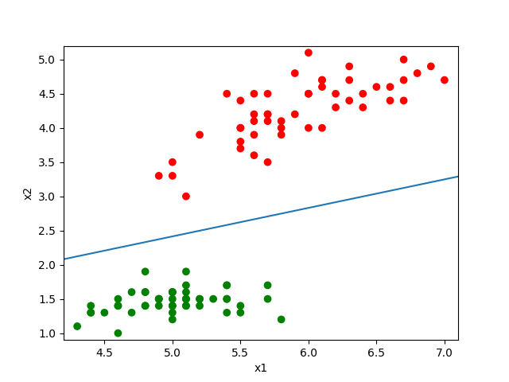

# Support Vector Machine in PyTorch

This repository implements SVM from scratch using PyTorch. Currently we only have the simple Linear-SVM implementation, will consider add SVM with kernel in the future. 

We understand SVM is effectively implemented by `scikit-learn` and other well-known libraries. 
This project is mainly for the purpose of self-understanding of SVM and an attempt for building it from scratch using PyTorch. 

Our current dataset is quite small, hence GPU implementation is not necessary here. 
We will consider it when dataset become larger. 

## Data
We use the [Iris dataset](https://www.kaggle.com/uciml/iris) from Kaggle. It has three categories, but we remove one category for the purpose of SVM. 

Although the model support inputs from dimension at least 1, but it is recommended to use inputs of dimension at least 2. 

We currently support dataset from a `.csv` file. To use our repository, you don't need to clean up and filter the columns by yourself. 
It is highly recommended to just specify the column names and the target category in the `train.py` and also `inference.py` file. 

Below is an example of modifying entries in `train.py` file:
```
# Input necessary data here
csv_file = "Iris.csv"
input_cols = ['SepalLengthCm', 'PetalLengthCm']
output_col = 'Species'
cat_one = 'Iris-setosa'  # Will be labelled 1
cat_two = 'Iris-versicolor' # Will be labelled -1
```
Hence the model will only use `SepalLengthCm` and `PetalLengthCm` as inputs (so the input is 2-dimensional), then output the category as either `Iris-setosa` or `Iris-versicolor`.
Also note that the dataset will automatically ignore `Iris-virginica` under this setting. 
You can investigate `Iris.csv` for detailed understanding. 

## Training

In the script `train.py` between lines `12` to `29`, the user may input all necessary information required for training.

The flag `visualize_data` will be used when input dimension is 2, then the data will be plotted on $xy$-plane, the user can inspect whether the dataset is linearly separable before training. 

After configure all settings, run the command below to train a model.
```
python train.py
```

It will saves a model in the current directory, which will be used in the next step. 

## Inference

In the script `inference.py` lines `42` to `45`, input necessary information. 
The flag `draw_svm` will be used when input dimension is 2, then the data will be plotted on $xy$-plane, together with the SVM straight line for separating the two categories. 

Then, on lines `47` to `51`, copy the variables from `train.py` and paste it into `inference.py`. 

Then, run the following command to get inference results.
```
python inference.py
```

## Misc
An example plot from `inference.py`

